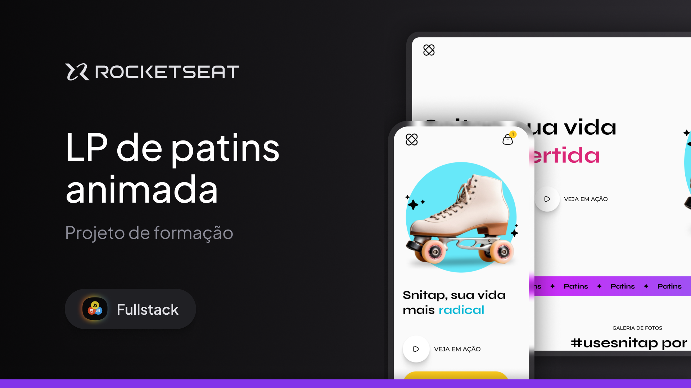

 <h1>🛼 Snitap</h1>
  

    Projeto desenvolvido durante o curso da <strong>Rocketseat</strong>, com foco em <strong>animações e transições</strong> em interfaces web. 
    O <strong>Snitap</strong> é um site moderno e responsivo para venda de patins, com um visual atraente e uma navegação fluida.
  

  

  <h2>💻 Descrição</h2>
  

    O site foi construído com <strong>HTML</strong> e <strong>CSS</strong> puros, buscando uma experiência de usuário leve e dinâmica. 
    Entre os principais destaques estão:
  

  <ul>
    <li>Design totalmente <strong>responsivo</strong>, adaptado para diferentes tamanhos de tela;</li>
    <li><strong>Transições suaves</strong> e <strong>animações</strong> que trazem vida à navegação;</li>
    <li>Código limpo e organizado, com boas práticas aprendidas no curso.</li>
  </ul>

  <h2>🚀 Tecnologias</h2>
  

    
    
    
    
  

   

  
<small>Thank you for reading! ❤️</small>
